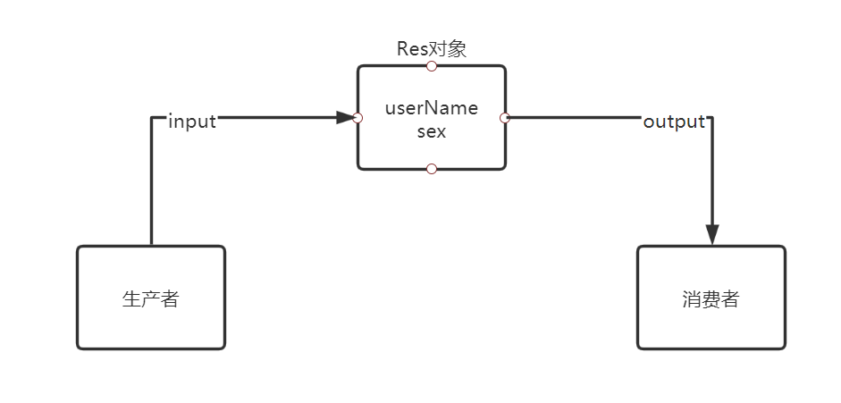

#### 1. 什么是进程?什么是线程?多线程有哪些应用场景?

​	进程是一个应用程序.线程是一个进程中的执行场景或者说是执行单元.一个进行可以启动多个线程

​	对于Java来说 启动Java程序,首先会激动JVM,JVM就是一个进程,JVM再启动一个主线程调用main方法,或者再启动一个垃圾回收线程进行负责回收垃圾.

​	两个进程之间资源不共享,两个线程之间堆内存和方法区内存共享,但是栈不共享.是属于一个线程一个栈

​	多线程的应用场景: 

​		1) 异步的实现发送短信,快速提高响应,用户的体验好

​		2) 异步的实现记录日志

​		3) 支付异步回调

​		4) 对我们后端接口中比较耗时间的代码都可以采用异步实现.

​		目的: 就是为了提高对HTTP协议的响应

<!--more-->

#### 2. 并发和并行的区别

- 并发是一个处理器同时处理多个任务
- 并行是多个处理器或者是多核的处理器同时处理多个不同的任务

就好比是,并发是一个人同时吃三碗饭,并行就三个人同时吃三碗饭

#### 3. 对于单核的cpu来说,可以做到真正的多线程并发吗?什么是真正的多线程并发?多线程是开的越多越好吗?

​	A线程执行A,B线程执行B.A不会影响B,B也不会影响A,这就叫做真正的多线程并发.

​	单核的cpu不能狗做到真正的多线程并发,但是可以做到一种多线程并发的感觉.其实对于单核的cpu来说,在某一个时间点上实际只能处理一件事情.

​	如果在服务器上频繁的开启线程,会影响到服务器的性能,如果是项目比较小的话,可以采用多线程实现异步,如果是项目比较大或者高并发的情况下建议使用MQ实现异步.

#### 4. Java创建线程的方式(简单的)

- 编写一个类,继承Tread方法即可.
- 编写一个类,实现Runable接口,然后new Tread(编写的类)即可.
- 再调用start方法即可.
- 如果直接调用线程类的run方法,就不会启动方法,就等于是调用一个普通的方法

多线程创建小例子:

```java
public class MyThread {
    public static void main(String[] args) {
        System.out.println("开始线程!");
        new Thread(()->{
            for (int i = 0; i < 10; i++) {
                System.out.println("自定义线程1 -> " + i );
            }
        }).start();
        new Thread(new Runnable() {
            @Override
            public void run() {
                for (int i = 0; i <10 ; i++) {
                    System.out.println("自定义线程2 -> "+i);
                }
            }
        }).start();
        for (int i = 0; i <10 ; i++) {
            System.out.println("main线程-> " +i);
        }
        System.out.println("主线程结束!");
    }
}
```

#### 5. Java创建线程的方式(补充)

- Callable接口,可以带返回结果的线程 底层原理就是wait和notify包装而成的 
- 线程池 四种实现方式,但是alibaba官方文档不推荐使用
- 利用框架如spring提供异步注解`@Asyn`

```java
public class CallableThread implements Callable<String> {
    @Override
    public String call() throws Exception {
        Thread.sleep(3000);
        return "Callable实现多线程的创建,并且有返回值!";
    }
    //callable接口是有返回值的
    public static void main(String[] args) throws ExecutionException, InterruptedException {
        FutureTask<String> futureTask = new FutureTask<>(new CallableThread());
        new Thread(futureTask).start();
        //必须要等待线程结束完成,才能获取到返回值;
        //相当于如果需要获取返回值,那么就是一个类似单线程,如果不要返回值,才会是类似多线程的样子
        //并且如果有返回值,将会堵塞接下来的代码,使接下来的代码一起等待线程结束,再从上往下执行
        System.out.println(futureTask.get());
        System.out.println("主线程完毕!");
    }
}
```

```java
//线程池的使用
public class ThreadPool {
    public static void main(String[] args) {
        //线程池的核心就是帮助我们做复用机制.
        ExecutorService executorService = Executors.newCachedThreadPool();
        executorService.execute(()->{
            System.out.println(Thread.currentThread().getName()+"我是线程池!!");
        });
    }
}
```

使用`@Async`实现异步

controller:

```java
@RestController
public class SpringAsync {
    @Resource
    private AsyncManage asyncManage;
    @GetMapping("/springAsync")
    public String springAsync() throws InterruptedException {
        asyncManage.print();
        //做查询操作
        Thread.sleep(1000);
        return "登录成功!";
    }
}
```

`@Async`无返回值实现:

```java
@Component
public class AsyncManage{
    @Async
    public void print() throws InterruptedException {
        print1();
        print2();
        print3();
    }

    public void print1() throws InterruptedException {
        System.out.println("打印日志!");
        Thread.sleep(2000);
    }

    public void print2() throws InterruptedException {
        System.out.println("发送邮件!");
        Thread.sleep(2000);
    }

    public void print3() throws InterruptedException {
        System.out.println("发送短信!");
        Thread.sleep(2000);
    }
}
```

`@Async`有返回值实现(利用Callable):

```java
@Async
    public Future<String> printString() throws InterruptedException {
        print1();
        print2();
        print3();
        return  new AsyncResult<>("有返回值的异步处理已完成!");
    }
```

​	在不访问其返回结果的时候就是异步处理,访问其结果的就是单线程处理的感觉

有几个限制：

- 两个方法都在同一个类里面，只是一个方法调用另一个异步方法，不生效。

  解决方法：拆分两个方法，将异步方法单独放在一个类里面，然后再去调用就解决了。

- 有接口方法的实现类里的注解不生效.

  解决方法：在实现类中调用一个没有接口的类才可以。

- `@SpringBootApplication`启动类当中需要添加`@EnableAsync`注解。

  异步方法使用注解`@Async`的返回值只能为void或者Future。

#### 6. 用户线程和守护线程的区别

区别:

- 用户线程,当我们主线程停止之后,用户线程不会随着主线程停止.
- 守护线程,当我们主线程停止之后,守护线程会随着主线程停止.

守护线程的使用场景

- GC线程,垃圾回收

Java默认情况创建的线程都是用户线程,设置守护线程的方法:

```java
Thread.setDaemon(true);
```

#### 7. 停止线程

 不建议使用stop方法停止线程,因为它底层使用强制停止线程,如果代码没有执行完毕的情况下也是强行停止.可以使用编码知识,例如判断条件为false或者true来进行判断执行,停止线程只用改成false即可.

#### 8. 线程的生命周期

- 新建状态 ----- 调用start方法
- 就绪状态 ----- 又叫可运行状态,具有抢夺CPU时间片的权利(执行权)
- 运行状态 ----- run方法的执行标志着线程开始进入运行状态
- 阻塞状态 ----- 当遇到阻塞时间(sleep方法等),此时线程会进入阻塞状态,处于阻塞状态会放弃当前占有的CPU时间片,结束后回到就绪状态
- 死亡状态

#### 9. 什么是线程安全问题?怎么去解决?

​	产生背景:同时,做写的操作.

​	当多个线程同时共享一个全局变量做写的操作的时候,可能会受到其他线程的干扰,就会产生一个线程安全的问题.导致数据的脏.

​	解决核心思想:在同一个时刻,只能有一个线程执行.那么这个时候就是单线程执行.只要加上锁缺点,就是对程序的执行效率很低.

​	Java中如何去解决线程问题:

​		1) Lock锁

​		2) synchronized关键字

​		3) cas无锁机制

​		4) 手写乐观锁

​	synchronized加锁之后怎么解决线程安全问题?

​	在多个线程中,同时执行同一个方法的时候,必须要先获取锁,只有在获取锁的情况下,才可以进入到方法中执行.举个例子: 如果A线程在获取锁的情况下,那么B线程就是一直是处于阻塞等待状态,整个一个过程就是悲观锁,必须要等到A线程执行代码释放锁之后,B线程重新进入到获取锁的状态.

#### 10. synchronized使用方式

代码块形式

​	1) 使用到synchronized锁的时候可以使用任何对象作为锁

​	2) 如果在方法上加上synchronized关键字,默认使用this锁

​	注意: 如果方法是一个静态方法的情况下,就使用当前类的class字节码做为锁,如果当前方法是一个非静态方法的情况下则使用this锁.

#### 11. 什么叫锁的可重入锁?多线程死锁现象以及怎么去排查?

​	如果说当前的线程获取到锁的情况下,而且是同样的锁和同一个线程内,在此请求的时候可以直接获取到锁,可以传递锁,这就是锁的可重入性.

​	多线程死锁的产生背景: 在同步中嵌套同步,也就是在锁中嵌套锁

​	也就是: 当线程1要获取A锁,并且还要过去B锁才能执行完成,而线程2要先获取B锁,再获取A锁才能执行完成,所以这两个线程就互相成为死锁.

​	死锁怎么去排查: JDK中自带多线程死锁排查工具.jconsole.exe

#### 12. Lock锁和synchronized锁的区别

​	synchronized属于Java中的一个内置的关键字,是有Java进行封装好的,Lock是基于aqs封装的锁.

​	举个例子:synchronized相当于是一个自动挡,当代码运行完毕或者抛出异常的时候,锁会进行自动的释放.Lock锁就相当于是一个手动挡,可以完全人为的控制获取锁或者释放锁,所以他的扩展性非常高.Lock锁里面有分为读写锁.

#### 13. Lock锁用法

基础用法:

```java
public class LockThread extends Thread {

    private int count = 100;
    private Lock lock = new ReentrantLock();

    @Override
    public void run() {
        while (count > 0) {
            ticket();
        }
    }

    private void ticket() {
        try {
            Thread.sleep(20);
        } catch (InterruptedException e) {
            e.printStackTrace();
        }
        try {
            lock.lock();
            if (count > 0) {
                System.out.println(Thread.currentThread().getName() + " 正在出票,第 " + (100 - count + 1) + "张");
                count--;
            }
        } catch (Exception e) {
            e.printStackTrace();
        } finally {
            lock.unlock();
        }
    }

    public static void main(String[] args) {
        LockThread lockThread = new LockThread();
        new Thread(lockThread).start();
        new Thread(lockThread).start();

    }
}

```

读写锁用法:

```java
public class ReadWriteLockThread {
    private ReadWriteLock lock = new ReentrantReadWriteLock();

    //多个线程同时读,读读共享,可以多个线程同时访问
    public void read() {
        lock.readLock().lock();
        System.out.println(Thread.currentThread().getName() + ",开始读取数据");
        try {
            Thread.sleep(3000);
        } catch (InterruptedException e) {
            e.printStackTrace();
        }
        System.out.println(Thread.currentThread().getName() + ",结束读取数据");
        lock.readLock().unlock();
    }

    //如果多个线程同时写的情况 写写互斥
    public void write() {
        try {
            lock.writeLock().lock();
            System.out.println(Thread.currentThread().getName() + ",开始写入数据");
            try {
                Thread.sleep(1000);
            } catch (InterruptedException e) {
                e.printStackTrace();
            }
            System.out.println(Thread.currentThread().getName() + ",结束写入数据");
        } catch (Exception e) {
            e.printStackTrace();
        } finally {
            lock.writeLock().unlock();
        }
    }

    public static void main(String[] args) {
        ReadWriteLockThread thread = new ReadWriteLockThread();
        for (int i = 0; i < 10; i++) {
            new Thread(thread::read).start();
        }
        for (int i = 0; i < 10; i++) {
            new Thread(thread::write).start();
        }
        //读写混合的时候,读写分离互斥,先读或者先写
    }
}
```

#### 14. Java多线程之间如何实现通讯

​	多个线程之间实现通讯是要用到wait和notify.

​	wait: 会让当前的线程变成阻塞状态,同时会释放锁



比如如图所示,可以开启两个线程,一个线程为生产者,专门做写入操作,一个线程为消费者,专门做读操作,他们之间的通讯用Res对象来进行维护.

按照以上条件编写一个demo:

```java
public class WaitAndNotifyThread {
    class Res {
        private String userName;
        private String sex;


        public String getUserName() {
            return userName;
        }

        public void setUserName(String userName) {
            this.userName = userName;
        }

        public String getSex() {
            return sex;
        }

        public void setSex(String sex) {
            this.sex = sex;
        }

        @Override
        public String toString() {
            return "Res{" +
                    "userName='" + userName + '\'' +
                    ", sex='" + sex + '\'' +
                    '}';
        }
    }

    class InputThread extends Thread {
        private Res res;

        public InputThread(Res res) {
            this.res = res;
        }

        //写入线程
        @Override
        public void run() {
            int count = 0;
            while (true) {
                if (count == 0) {
                    res.setSex("男");
                    res.setUserName("cw");
                } else {
                    res.setSex("女");
                    res.setUserName("xl");
                }
                count = (count + 1) % 2;
            }
        }
    }

    class OutputThread extends Thread {
        private Res res;

        public OutputThread(Res res) {
            this.res = res;
        }
        //读线程
        @Override
        public void run() {
            while (true) System.out.println(res);
        }
    }

    public static void main(String[] args) {
        Res res = new WaitAndNotifyThread().new Res();
        new WaitAndNotifyThread().new InputThread(res).start();
        new WaitAndNotifyThread().new OutputThread(res).start();
    }
}
```

以上很明显的错误,没有处理全局变量res的线程安全性问题.

然后在输入输出的地方加入锁呢?

```java
 			while (true) {
               synchronized (this){
                   System.out.println(res);
               }
            }
-------------------------
    		while (true) {
                synchronized (this){
                    if (count == 0) {
                        res.setSex("男");
                        res.setUserName("cw");
                    } else {
                        res.setSex("女");
                        res.setUserName("xl");
                    }
                    count = (count + 1) % 2;
                }
            }
```

经过测试并发现,this锁并不是同一把锁,因为他们本身的类不一样,对象也不一样,所以应该加上同一把锁,res,因为res是从主方法中new的一个对象传入构造器中的,为同一个对象故是用一把锁.

```java
while (true) {
               synchronized (res){
                   System.out.println(res);
               }
            }
------------------------------------------------------------
    		while (true) {
                synchronized (res){
                    if (count == 0) {
                        res.setSex("男");
                        res.setUserName("cw");
                    } else {
                        res.setSex("女");
                        res.setUserName("xl");
                    }
                    count = (count + 1) % 2;
                }
            }
```

以上的代码线程安全问题解决了,但是还是出现大量的重复数据,这是因为在进行读数据的时候,读的线程抢夺cpu能力强,导致一直读取res,因为又是同一把锁,再读取的时候,又没有办法进行写入,所以导致读的时候有着大量的重复数据,这时候就可以用到wait和notify的机制来进行等待唤醒.当处于wait状态时,会自动的释放锁.

```java
		 while (true) {
               synchronized (res){
                   res.notify();
                   System.out.println(res);
                   try {
                       res.wait();
                   } catch (InterruptedException e) {
                       e.printStackTrace();
                   }
               }
            }
-------------------------------------
    		while (true) {
                synchronized (res){
                    if (count == 0) {
                        res.setSex("男");
                        res.setUserName("cw");
                    } else {
                        res.setSex("女");
                        res.setUserName("xl");
                    }
                    res.notify();
                    count = (count + 1) % 2;
                    try {
                        res.wait();
                    } catch (InterruptedException e) {
                        e.printStackTrace();
                    }
                }
            }
```

