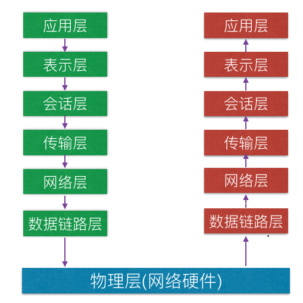
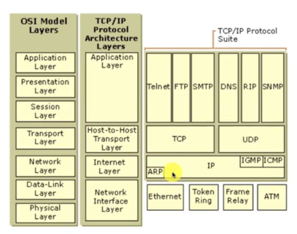

### 什么是网络?计算机网络的构成是什么?

​	在计算机领域中，网络是信息传输、接收、共享的虚拟平台.通过它把各个点,面,体的信息联系到一起,从而实现对这些资源的共享.

### 什么是网络编程?

- 从大的方面来说,就是对信息的发送到接受
- 通过操作响应的api调度计算机硬件资源,并利用传输管道(例如网线)进行数据交换的过程
- 更为具体的涉及:网络模型,套接字,数据包

<!--more-->

### 7层网络模型-OSI

- 应用层: 应用层是最靠近用户的OSI层。这一层为用户的应用程序（例如电子邮件、文件传输和终端仿真）提供网络服务。协议有：HTTP FTP TFTP SMTP SNMP DNS TELNET HTTPS POP3 DHCP等。
- 表示层: 数据的表示、安全、压缩。可确保一个系统的应用层所发送的信息可以被另一个系统的应用层读取。格式有：JPEG、ASCll、DECOIC、加密格式等。
- 会话层:建立、管理、终止会话，对应主机进程，指本地主机与远程主机正在进行的会话。常见的格式:服务器验证用户的登录,断点续传
- 传输层: 定义传输数据的协议端口号，以及流控和差错校验。协议有：TCP UDP等，数据包一旦离开网卡即进入网络传输层。
- 网络层: 进行逻辑地址寻址，实现不同网络之间的路径选择。协议有：ICMP IGMP IP（IPV4 IPV6） ARP RARP等。
- 数据链路层: 建立逻辑连接、进行硬件地址寻址、差错校验等功能。（由底层网络定义协议）数据链路层协议的代表包括：SDLC、HDLC、PPP、STP、帧中继等。
- 物理层: 建立、维护、断开物理连接。（由底层网络定义协议）物理层的任务就是为它的上一层提供一个物理连接，以及它们的机械、电气、功能和过程特性。如规定使用电缆和接头的类型、传送信号的电压等。在这一层，数据还没有被组织，仅作为原始的位流或电气电压处理，单位是bit比特。

网络模型编程:

- 基础层: 物理层,数据链路层,网络层
- 传输层: TCP-UDP协议层,Socket (主要是在传输层以上的封装,并不进行传输层面的封装,因为TCP-UDP本身就是传输层的东西,我们的目的就是为了怎样的去用他)
- 高级层: 会话层,表示层,应用层

#### 网络模型的对应关系:

- TCP所封装的技术:telent,FTP,SMTP
- UDP所封装的技术:DNS,RIP,SNMP
- TCP与UDP中都用到了IP

### Socket与TCP,UDP

- Socket就是对TCP与UDP进行封装.
- Socket简单来说就是ip地址与端口的结合协议(RFC 793).
- 是一个种地址与端口的结合描述协议.
- TCP/IP协议的相关API的总称;是网络API的集合实现.
- Socket的作用和组成.
  - 在网络传输中用于唯一标示两个端点的链接.
  - 端点包括IP+port(端口).
  - 四个要素:客户端的地址,客户端的端口,服务端的地址,服务端的端口.
- TCP是面向连接的通信协议.
- 通过三次握手建立连接,通讯完成时要拆除连接.
- 由于TCP是面向连接的,所以只能用于端到端的通讯(就是在某一时刻,只能面向这一个端口)
- UDP是面向无连接的通讯协议.
- UDP数据包括目的的端口号和源端口号的信息
- 由于通讯不需要连接,所以可以实现广播发送,并不局限于端对端

#### TCP传输

​	一个数据发送到服务器上,是基于TCP数据发送,同时会收到一条TCP的回复,说明已经收到了(回复并不是我们来完成的,而是TCP层面,数据层面已经完成了封装, 当我们发送数据的时候,只有两个状态,要么发送成功,要么发送失败)

#### UDP传输

​	UDP只管发送,并不管服务器是否接收到.

### Client-Server Application

- TCP/IP协议中,两个进程间的通信的主要模式为:CS模式(客户端服务端)
- 主要目的:协同网络中的计算机资源,服务模式,进程间的数据共享
- 常见的:FTP.SMTP,HTTP

### Socket TCP小案例

在本次案例中:

- 构建TCP客户端,服务端
- 客户端发送数据
- 服务器读取数据并打印数据

