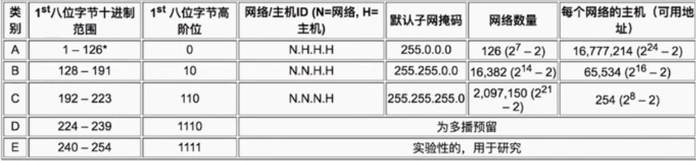
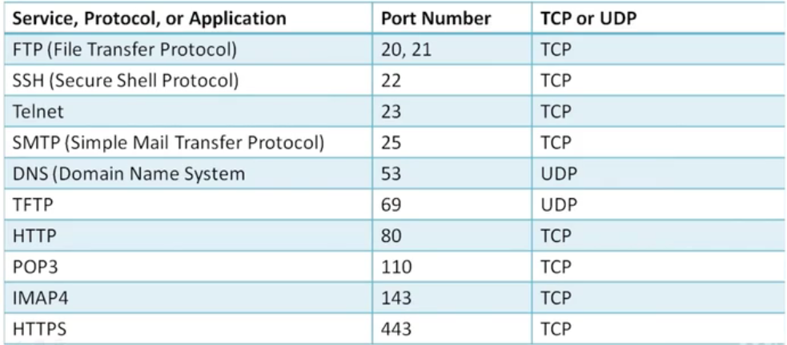
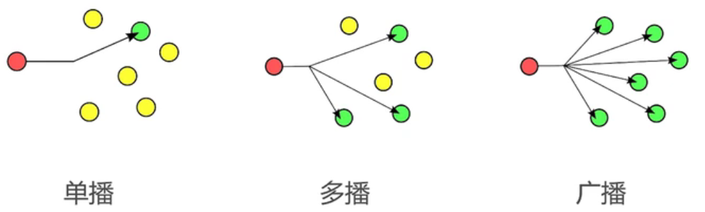

### 什么是网络?计算机网络的构成是什么?

​	在计算机领域中，网络是信息传输、接收、共享的虚拟平台.通过它把各个点,面,体的信息联系到一起,从而实现对这些资源的共享.

### 什么是网络编程?

- 从大的方面来说,就是对信息的发送到接受
- 通过操作响应的api调度计算机硬件资源,并利用传输管道(例如网线)进行数据交换的过程
- 更为具体的涉及:网络模型,套接字,数据包

<!--more-->

### 7层网络模型-OSI


- 应用层: 应用层是最靠近用户的OSI层。这一层为用户的应用程序（例如电子邮件、文件传输和终端仿真）提供网络服务。协议有：HTTP FTP TFTP SMTP SNMP DNS TELNET HTTPS POP3 DHCP等。
- 表示层: 数据的表示、安全、压缩。可确保一个系统的应用层所发送的信息可以被另一个系统的应用层读取。格式有：JPEG、ASCll、DECOIC、加密格式等。
- 会话层:建立、管理、终止会话，对应主机进程，指本地主机与远程主机正在进行的会话。常见的格式:服务器验证用户的登录,断点续传
- 传输层: 定义传输数据的协议端口号，以及流控和差错校验。协议有：TCP UDP等，数据包一旦离开网卡即进入网络传输层。
- 网络层: 进行逻辑地址寻址，实现不同网络之间的路径选择。协议有：ICMP IGMP IP（IPV4 IPV6） ARP RARP等。
- 数据链路层: 建立逻辑连接、进行硬件地址寻址、差错校验等功能。（由底层网络定义协议）数据链路层协议的代表包括：SDLC、HDLC、PPP、STP、帧中继等。
- 物理层: 建立、维护、断开物理连接。（由底层网络定义协议）物理层的任务就是为它的上一层提供一个物理连接，以及它们的机械、电气、功能和过程特性。如规定使用电缆和接头的类型、传送信号的电压等。在这一层，数据还没有被组织，仅作为原始的位流或电气电压处理，单位是bit比特。

网络模型编程:

- 基础层: 物理层,数据链路层,网络层
- 传输层: TCP-UDP协议层,Socket (主要是在传输层以上的封装,并不进行传输层面的封装,因为TCP-UDP本身就是传输层的东西,我们的目的就是为了怎样的去用他)
- 高级层: 会话层,表示层,应用层

#### 网络模型的对应关系:


- TCP所封装的技术:telent,FTP,SMTP
- UDP所封装的技术:DNS,RIP,SNMP
- TCP与UDP中都用到了IP

### Socket与TCP,UDP

- Socket就是对TCP与UDP进行封装.
- Socket简单来说就是ip地址与端口的结合协议(RFC 793).
- 是一个种地址与端口的结合描述协议.
- TCP/IP协议的相关API的总称;是网络API的集合实现.
- Socket的作用和组成.
  - 在网络传输中用于唯一标示两个端点的链接.
  - 端点包括IP+port(端口).
  - 四个要素:客户端的地址,客户端的端口,服务端的地址,服务端的端口.
- TCP是面向连接的通信协议.
- 通过三次握手建立连接,通讯完成时要拆除连接.
- 由于TCP是面向连接的,所以只能用于端到端的通讯(就是在某一时刻,只能面向这一个端口)
- UDP是面向无连接的通讯协议.
- UDP数据包括目的的端口号和源端口号的信息
- 由于通讯不需要连接,所以可以实现广播发送,并不局限于端对端

#### TCP传输

​	一个数据发送到服务器上,是基于TCP数据发送,同时会收到一条TCP的回复,说明已经收到了(回复并不是我们来完成的,而是TCP层面,数据层面已经完成了封装, 当我们发送数据的时候,只有两个状态,要么发送成功,要么发送失败)

#### UDP传输

​	UDP只管发送,并不管服务器是否接收到.

### Client-Server Application

- TCP/IP协议中,两个进程间的通信的主要模式为:CS模式(客户端服务端)
- 主要目的:协同网络中的计算机资源,服务模式,进程间的数据共享
- 常见的:FTP.SMTP,HTTP

### Socket TCP小案例

在本次案例中:

- 构建TCP客户端,服务端
- 客户端发送数据
- 服务器读取数据并打印数据

服务端:

```java
public class Server {
    public static void main(String[] args) throws IOException {
        ServerSocket server = new ServerSocket(2000);
        System.out.println("服务器准备就绪!");
        System.out.println("服务器信息 : " + server.getInetAddress() + "端口号 : " + server.getLocalPort());

        //等待客户端连接
        while (true) {
            //得到客户端
            Socket clientSocket = server.accept();
            //客户端构建异步线程
            ClientHandler clientHandler = new ClientHandler(clientSocket);
            clientHandler.start();
        }
    }

    //对多个客户端进行异步处理
    private static class ClientHandler extends Thread {
        private Socket socket;
        private boolean flag = true;

        public ClientHandler(Socket socket) {
            this.socket = socket;
        }

        @Override
        public void run() {
            System.out.println("新客户端连接: " + socket.getInetAddress() + "端口号" + socket.getPort());
            try {
                //得到输出流,用于输出数据
                PrintStream socketOutput = new PrintStream(socket.getOutputStream());
                //服务器的输入流就等于客户端的输出流,得到数据
                BufferedReader socketReader = new BufferedReader(new InputStreamReader(socket.getInputStream()));
                do {
                    String str = socketReader.readLine();
                    if ("bye".equals(str)) {
                        flag = false;
                        socketOutput.println("bye");
                    }
                    //打印到控制台,并且回复一句话
                    System.out.println("客户端发来的数据 : " + str);
                    socketOutput.println(str.length() + ",有这么长的话!");
                } while (flag);
                socketOutput.close();
                socketReader.close();
            } catch (Exception e) {
                System.out.println("连接异常断开");
            }
            finally {
                try {
                    socket.close();
                } catch (IOException e) {
                    e.printStackTrace();
                }
                System.out.println("客户端已经关闭");
            }
        }
    }
}
```

客户端:

```
public class Client {
    public static void main(String[] args) throws IOException {
        Socket socket = new Socket();
        //超时时间
        socket.setSoTimeout(3000);
        //连接本地地址,端口号为2000,超时时间3s
        socket.connect(new InetSocketAddress(Inet4Address.getLocalHost(), 2000), 2000);
        System.out.println("已向服务器发起连接!等待后续!");
        System.out.println("客户端信息 : " + socket.getLocalAddress() + "端口号 : " + socket.getLocalPort());
        System.out.println("服务器信息 : " + socket.getInetAddress() + "端口号 : " + socket.getPort());
        try {
            //发送数据
            todo(socket);
        } catch (IOException e) {
            System.out.println("异常关闭!");
        }
        //释放资源
        socket.close();
        System.out.println("客户端已经退出!");
    }

    public static void todo(Socket client) throws IOException {
        //得到键盘输入流
        InputStream in = System.in;
        //转换为包装字符流
        BufferedReader reader = new BufferedReader(new InputStreamReader(in));

        //得到Socket输出流
        OutputStream outputStream = client.getOutputStream();
        //转换成打印流
        PrintStream printStream = new PrintStream(outputStream);
        //得到Socket输入流
        InputStream inputStream = client.getInputStream();
        BufferedReader socketReader = new BufferedReader(new InputStreamReader(inputStream));
        boolean flag = true;
        do {
            //键盘读取一行
            String msg = reader.readLine();
            //发送给服务器
            printStream.println(msg);

            //从服务器获取一行
            String socketMsg = socketReader.readLine();
            if ("bye".equals(socketMsg)) flag = false;
            else System.out.println(socketMsg);
        } while (flag);
        reader.close();
        printStream.close();
        socketReader.close();
    }
}
```

### 报文,协议,Mac地址

#### 报文

- 报文段是指TCP/IP协议网络传输过程中,起着路由导航作用.
- 用以查询各个网络路由网段,IP地址,交换协议等IP数据包.
- 报文段充当整个TCP/IP协议数据包的导航路由功能.
- 报文在传输过程中会不断的封装成组,包,帧来传输.(当传输一些大数据的时候,会将大数据转换成组或者包,帧解析成一个个小的数据点,通过小的数据点来传输.)
- 封装的方式就是添加一些控制信息组成的头部,即报文头.

#### 传输协议

- 协议顾名思义,一种规定,约束
- 约定大于配置,在网络传输中同样也适应;网络传输的流程是健壮的稳定的,得益于基础的协议构成.
- 简单来说: A->B的传输数据,B能识别,反之B->A,A也能识别,这就是协议.

#### Mac地址

- Mac地址叫 Media Access Control或者Medium Access Control翻译为谋体访问控制,或为物理地址,硬件地址.
- 用来定义网络设备的位置
- 比如11-22-33-44-55-66 11:22:33:44:55:66 类似于身份证

### IP,端口,远程服务器

#### IP地址

- 即互联网协议地址 
- 是分配给网络上使用网际协议的设备的数字标签
- 常见的IP分为IPv4和IPv6两大类
- IP地址由32为二进制数组成,常以xxx.xxx.xxx.xxx形式出现,每组xxx代表小于或等于255的10进制数.
- IP地址分为A.B,C,D,E五大类,其中E类为特殊保留地址.



- IPv4的数量比较少只有42亿个,已经在2011年分配完了
- IP地址-IPv6
  - 总共有128位长,采用32个16进制
  - 由两个逻辑部分组成:一个64位的网络前缀和一个64位的主机地址，主机地址通常根据物理地址自动生成，叫做EUI-64（或者64-位扩展唯一标识)
- lPv4转换为IPv6一定可行，lPv6转换为IPv4不一定可行

#### 端口

- 如果把IP地址比作一间房子，端口就是出入这间房子的门或者窗户
- 0到1023号端口以及1024到49151号端口都是特殊端口



- 计算机之间依照互联网传输层TCP/IP协议的协议通信，不同的协议都对应不同的端口
- 49152到65535号端口属于动态端口范围，没有端口可以被正式地注册占用
- 电脑的总端口数为65536个,一个IP地址有这么多个.如果你的本机有多个IP,那么也会有很多个.

#### 远程服务器

- 局域网︰一般而言，家里的环境以及公司相互电脑之间环境都属于局域网
- 我的电脑与我的手机之间属于局域网,我的电脑与陌生人的电脑属于互联网

### Socket-UDP快速入门

#### UDP是什么

- 是一种用户数据报协议,又称用户数据报文协议
- 是一个简单的面向数据报的传输层协议，正式规范为RFC 768
- 是一个用户数据协议,不是连接协议.

#### UDP什么不可靠

- 它一旦把应用程序发给网络层的数据发送出去,就不保留备份(在UDP的数据层面,它只管发送或者接受数据,不对这个数据进行保留备份重发等等)
- UDP在IP数据报的头部仅仅加入了复用和数据校验（字段)
- 在发送端生产数据,接收端从网络中抓取数据.(所以它们数据发送,是不需要连接的)
- 结构简单,无校验,速度快,容易丢包,但是可以广播

#### UDP能做什么

- DNS(访问网站DNS解析)、TFTP(文件传输的协议)、SNMP(网络数据协议传输中的监控的协议)
- 视频,音频(本身比较大,主要是用于直播),普通数据(无关紧要的数据) (下载视频音频还是要用TCP)
- UDP的最大长度 16位2字节 就是2的16次方-1 然后自身协议占用32+32位=64位=8字节,所以最大长度为2的16次方-8-1字节.

#### UDP核心API

- DatagramSocket 
  - 用于接收与发送UDP的类
  - 负责发送某一个UDP包或者接受UDP包
  - 不同于TCP,UDP并没有合并到Socket API中
  - 因为在UDP中是没有服务器和客户端的概念的,这个DatagramSocket 既是你的服务器,又是你的客户端,可以发送也可以接收,不用去监听某个客户端,不涉及客户端跟他的连接,不像TCP去监听一个TCP的来源,连接再进行通讯.
  - DatagramSocket() 构造函数 创建简单实例，不指定端口与IP,如果需要发送,那么会复用本地可用的端口进行发送数据
  - DatagramSocket(int port)创建监听固定端口的实例 可以指定某个端口进行监听,但是发送不是这个端口.
  - DatagramSocket(int port, InetAddress localAddr)创建固定端口指定IP的实例
  - receive(DatagramPacket d)∶接收
  - send(DatagramPacket d)∶发送
  - setSoTimeout(int timeout):设置超时，毫秒
  - close();关闭
- DatagramPacket
  - 用于处理报文
  - 将byte数组、目标地址、目标端口等数据包装成报文或者将报文拆卸成byte数组
  - 是UDP的发送实体,也是接收实体.
  - DatagramPacket(byte[] buf, int offset, int length, InetAddressaddress, int port)
    - 前三个参数指定buf的使用区间
    - 后两个参数指定目标机器地址与端口
  - setData(byte[] buf, int offset, int length),setData(byte[] buf),setData(int length)
  - getData(),getOffset(),getLength()

#### UDP单播,广播,多播




- 广播地址: 
  - 255.255.255.255为受限广播地址
  - C网广播地址一般为xxx.xxx.xxx.255
  - D类地址为多播预留


