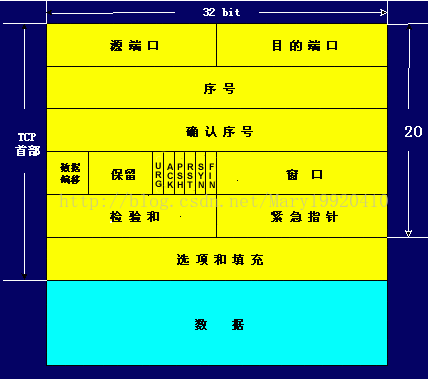
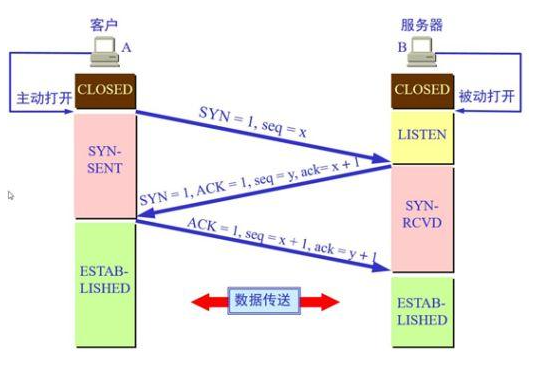
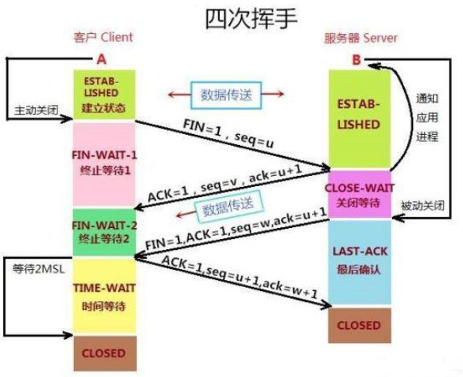

### TCP报文格式

​	TCP报文是TCP层层传输的数据单元,也叫报文段.

- **端口号**: 用来标识同一台计算机的不同的应用进程.
  - 源端口: 源端口和IP地址的作用是标识报文的返回地址.
  - 目的端口: 端扣指明接收方计算机上的应用程度接口.
  - TCP报头中的源端口号和目的端口号同IP数据报中的源IP与目的IP唯一确定一条TCP连接。

<!--more-->

- **序号(sequence number)**:**序号**是本报文段发送的数据组的第一个字节的序号。在TCP传送的流中，每一个字节一个序号。例如:一个报文段的序号为300，此报文段数据部分共有100字节，则下一个报文段的序号为400。所以序号确保了TCP传输的有序性.(Seq序号，占32位，用来标识从TCP源端向目的端发送的字节流，发起方发送数据时对此进行标记.)
- **确认号(acknowledgement number)**:即*ACK*，指明下一个期待收到的字节序号，表明该序号之前的所有数据已经正确无误的收到。确认号只有当*ACK*标志为1时才有效。比如建立连接时，SYN报文的*ACK*标志位为0,*Ack*=*Seq*+1.
- **数据偏移/首部长度**:4bits。由于首部可能含有可选项内容，因此TCP报头的长度是不确定的，报头不包含任何任选字段则长度为20字节，4位首部长度字段所能表示的最大值为1111，转化为10进制为15，15*32/8 = 60，故报头最大长度为60字节。首部长度也叫数据偏移，是因为首部长度实际上指示了数据区在报文段中的起始偏移值。
- **保留**：为将来定义新的用途保留，现在一般置0。
- **控制位(标志位)**：*URG*  *ACK*  *PSH*  *RST*  *SYN*  *FIN*，共6个，每一个标志位表示一个控制功能。
  - **URG**：紧急指针标志，为1时表示紧急指针有效，为0则忽略紧急指针。
  - **ACK**：确认序号标志，为1时表示确认号有效，为0表示报文中不含确认信息，忽略确认号字段。
  - **PSH**：push标志，为1表示是带有push标志的数据，指示接收方在接收到该报文段以后，应尽快将这个报文段交给应用程序，而不是在缓冲区排队。
  - **RST**：重置连接标志，用于重置由于主机崩溃或其他原因而出现错误的连接。或者用于拒绝非法的报文段和拒绝连接请求。
  - **SYN**：同步序号，用于建立连接过程，在连接请求中，SYN=1和ACK=0表示该数据段没有使用捎带的确认域，而连接应答捎带一个确认，即SYN=1和ACK=1。
  - **FIN**：finish标志，用于释放连接，为1时表示发送方已经没有数据发送了，即关闭本方数据流。
- **窗口**：滑动窗口大小，用来告知发送端接受端的缓存大小，以此控制发送端发送数据的速率，从而达到流量控制。窗口大小时一个16bit字段，因而窗口大小最大为65535。
- **校验和**：奇偶校验，此校验和是对整个的 *TCP* 报文段，包括 *TCP* 头部和 *TCP* 数据，以 *16* 位字进行计算所得。由发送端计算和存储，并由接收端进行验证。
- **紧急指针**：只有当 *URG* 标志置 *1* 时紧急指针才有效。紧急指针是一个正的偏移量，和顺序号字段中的值相加表示紧急数据最后一个字节的序号。 *TCP* 的紧急方式是发送端向另一端发送紧急数据的一种方式。
- **选项和填充**：最常见的可选字段是最长报文大小，又称为MSS（Maximum Segment Size），每个连接方通常都在通信的第一个报文段（为建立连接而设置SYN标志为1的那个段）中指明这个选项，它表示本端所能接受的最大报文段的长度。选项长度不一定是32位的整数倍，所以要加填充位，即在这个字段中加入额外的零，以保证TCP头是32的整数倍。
- **数据部分**： *TCP* 报文段中的数据部分是可选的。在一个连接建立和一个连接终止时，双方交换的报文段仅有 *TCP* 首部。如果一方没有数据要发送，也使用没有任何数据的首部来确认收到的数据。在处理超时的许多情况中，也会发送不带任何数据的报文段。

**注意:** 不要将确认序号Ack与标志位中的ACK搞混了。确认方Ack=发起方Seq+1，两端配对。

### TCP的三次握手

#### 三次握手详解

​	所谓三次握手即TCP连接的建立,这个连接必须是一方主动打开,另一方被动打开(一般是客户端主动打开服务端被动),一下为客户端主动发起连接的图解.

握手之前主动打开连接的客户端结束CLOSED阶段，被动打开的服务器端也结束CLOSED阶段，并进入LISTEN阶段。随后开始“三次握手”：

1. 首先客户端向服务器端发送一段TCP报文，其中：
   - 标记位为SYN，表示“请求建立新连接”;
   - 序号为Seq=X（X一般为1）；
   - 随后客户端进入SYN-SENT阶段。
2. 服务器端接收到来自客户端的TCP报文之后，结束LISTEN阶段。并返回一段TCP报文，其中：
   - 标志位为SYN和ACK，表示“确认客户端的报文Seq序号有效，服务器能正常接收客户端发送的数据，并同意创建新连接”（即告诉客户端，服务器收到了你的数据）；
   - 序号为Seq=y；
   - 确认号为Ack=x+1，表示收到客户端的序号Seq并将其值加1作为自己确认号Ack的值；随后服务器端进入SYN-RCVD阶段。
3. 客户端接收到来自服务器端的确认收到数据的TCP报文之后，明确了从客户端到服务器的数据传输是正常的，结束SYN-SENT阶段。并返回最后一段TCP报文。其中：
   - 标志位为ACK，表示“确认收到服务器端同意连接的信号”（即告诉服务器，我知道你收到我发的数据了）；
   - 序号为Seq=x+1，表示收到服务器端的确认号Ack，并将其值作为自己的序号值；
   - 确认号为Ack=y+1，表示收到服务器端序号Seq，并将其值加1作为自己的确认号Ack的值；
   - 随后客户端进入ESTABLISHED阶段。

服务器收到来自客户端的“确认收到服务器数据”的TCP报文之后，明确了从服务器到客户端的数据传输是正常的。结束SYN-SENT阶段，进入ESTABLISHED阶段。

在客户端与服务器端传输的TCP报文中，双方的确认号Ack和序号Seq的值，都是在彼此Ack和Seq值的基础上进行计算的，这样做保证了TCP报文传输的连贯性。一旦出现某一方发出的TCP报文丢失，便无法继续"握手"，以此确保了"三次握手"的顺利完成。

此后客户端和服务器端进行正常的数据传输。这就是“三次握手”的过程.

#### 为什么是三次握手?而不是两次或者四次?

​	前提: client发送第一个连接请求,但是该请求报文段并没有消失,可能因为网络原因滞留了,导致这个请求报文段将在client与server进行连接的释放后才送达到客户端.server端收到该请求报文后会认为client再次发出一个新的连接请求,就会向client发出确认报文.

- 如果是二次握手,那么只要server发出确认,新的连接就会建立起来,但是由于此时的client并没有发起连接,不会对server的确认进行处理,但是server却认为新的连接已经建立,server一直等到client发送数据,这样server的资源就会浪费.或者是 server发出确认的时候网络问题使得确认号丢失了,那么server是不知道client有没有接收到自己的发出的数据的.
- 如果是三次握手,当client收到server的确认指定的时候,会通过判断是否为自己发送的请求的回送,如果是则再次发送确认号给server,当server收到确认号后,两者的连接就开始了.
- 为什么不是四次握手,因为握手的目的就是为了让server知道client有通信能力,让client知道server有通信能力,但是由于三次握手已经让两者之间都已经确定的知道对方互相的情况,所以四次五次就没必要了.

或者参考这条回答: https://www.zhihu.com/question/24853633/answer/573627478

### TCP的四次挥手

#### 四次挥手的详解

所谓的四次挥手即TCP连接的释放(解除)。连接的释放必须是一方主动释放，另一方被动释放。以下为客户端主动发起释放连接的图解:

挥手之前主动释放连接的客户端结束ESTABLISHED阶段。随后开始“四次挥手”

1. 首先客户端想要释放连接，向服务器端发送一段TCP报文，其中：
   - 标记位为FIN，表示“请求释放连接“；
   - 序号为Seq=U；
   - 随后客户端进入FIN-WAIT-1阶段，即半关闭阶段。并且停止在客户端到服务器端方向上发送数据，但是客户端仍然能接收从服务器端传输过来的数据。
   - 注意：这里不发送的是正常连接时传输的数据(非确认报文)，而不是一切数据，所以客户端仍然能发送ACK确认报文。
2. 服务器端接收到从客户端发出的TCP报文之后，确认了客户端想要释放连接，随后服务器端结束ESTABLISHED阶段，进入CLOSE-WAIT阶段（半关闭状态）并返回一段TCP报文，其中：
   - 标记位为ACK，表示“接收到客户端发送的释放连接的请求”；
   - 序号为Seq=V；
   - 确认号为Ack=U+1，表示是在收到客户端报文的基础上，将其序号Seq值加1作为本段报文确认号Ack的值；
   - 随后服务器端开始准备释放服务器端到客户端方向上的连接。客户端收到从服务器端发出的TCP报文之后，确认了服务器收到了客户端发出的释放连接请求，随后客户端结束FIN-WAIT-1阶段，进入FIN-WAIT-2阶段
   - 前"两次挥手"既让服务器端知道了客户端想要释放连接，也让客户端知道了服务器端了解了自己想要释放连接的请求。于是，可以确认关闭客户端到服务器端方向上的连接了
3. 服务器端自从发出ACK确认报文之后，经过CLOSED-WAIT阶段，做好了释放服务器端到客户端方向上的连接准备，再次向客户端发出一段TCP报文，其中：
   - 标记位为FIN，ACK，表示“已经准备好释放连接了”。注意：这里的ACK并不是确认收到服务器端报文的确认报文。
   - 序号为Seq=W
   - ；确认号为Ack=U+1；表示是在收到客户端报文的基础上，将其序号Seq值加1作为本段报文确认号Ack的值。
   - 随后服务器端结束CLOSE-WAIT阶段，进入LAST-ACK阶段。并且停止在服务器端到客户端的方向上发送数据，但是服务器端仍然能够接收从客户端传输过来的数据。
4. 客户端收到从服务器端发出的TCP报文，确认了服务器端已做好释放连接的准备，结束FIN-WAIT-2阶段，进入TIME-WAIT阶段，并向服务器端发送一段报文，其中：
   - 标记位为ACK，表示“接收到服务器准备好释放连接的信号”。
   - 序号为Seq=U+1；表示是在收到了服务器端报文的基础上，将其确认号Ack值作为本段报文序号的值。
   - 确认号为Ack=W+1；表示是在收到了服务器端报文的基础上，将其序号Seq值作为本段报文确认号的值。
   - 随后客户端开始在TIME-WAIT阶段等待2MSL

服务器端收到从客户端发出的TCP报文之后结束LAST-ACK阶段，进入CLOSED阶段。由此正式确认关闭服务器端到客户端方向上的连接。

客户端等待完2MSL之后，结束TIME-WAIT阶段，进入CLOSED阶段，由此完成“四次挥手”。

与“三次挥手”一样，在客户端与服务器端传输的TCP报文中，双方的确认号Ack和序号Seq的值，都是在彼此Ack和Seq值的基础上进行计算的，这样做保证了TCP报文传输的连贯性，一旦出现某一方发出的TCP报文丢失，便无法继续"挥手"，以此确保了"四次挥手"的顺利完成。

