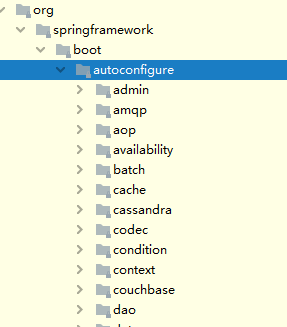
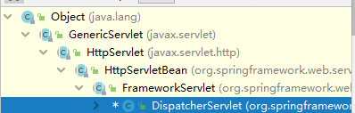
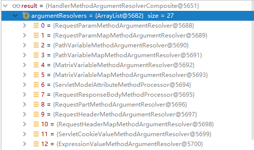
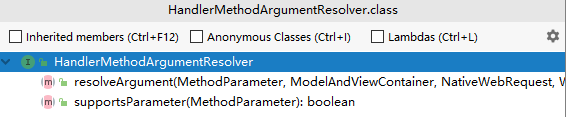

## springboot简介

 约定大于配置 : 按约定编程,是一种软件设计范式,目的是减少开发人员减少做决定的数量(就是规定制定文件放在什么位置).

 springboot中的约定有 : Maven的目录结构.默认resource文件夹存放配置文件.默认生成的编译后的代码都在target文件夹下.springboot默认的配置文件为:application开头等等一些.

 含有丰富的start,拿来即用.

## 快速上手

 在springboot项目中,加入打包插件后打成jar包 ,在 cmd界面启动jar包 命令: java -jar [文件名.jar]

 修改配置或者写自己的配置:首先创建一个application.properties或者application.yml文件(约定大于配置),比如修改端口号 server.port=xxxx; 增加虚拟路径: server.servlet.context-path= url

## 微服务和分布式的区别

 微服务: 是一种架构放个,一个应用可以拆分为一组小型服务,每个服务都可以运行在自己的进程内,也就是可独立部署和升级.服务间使用轻量级http(推荐)交互

 分布式: 将一个大的系统分成多个模块,,业务模块部署到不同的机器上,各个业务模块之间通过接口来进行交互,
​ 分布式容易出现的问题: 远程调用,服务发现,负载均衡,服务容错, 配置管理,服务监控,链路追踪,日志管理,任务调度,事务管理.

 集群: 就是很多相同的服务,一个或者多台服务器部署相同应用构成一个集群.

 微服务重在解耦合,使得每个模块都独立,分布式重在资源的共享和加快计算机的响应速度.一个是分散能力,一个是分散压力.

## springboot注解

 默认的扫描规则: 在启动类(`@SpringbootApplication`)所在包及子包是默认扫描的,
​ 想要改变扫描路径.可以手动修改,在`@SpringbootApplication(scanBasePackages="xxx")`就行,或者`@ComponentScan` (包扫描) 指定扫描路径.

 `@SpringBootApplication`等同于`@SpringBootConfiguration` + `@EnableAutoConfiguration` + `@ComponentScan`

 `@Configuration` 表示这个一个配置类 ,相当于spring中的配置文件。在springboot中,proxyBeanMethods是默认=true的(proxyBeanMethods: 是不是代理类的方法,如果是true,那么就是代理对象调用方法,去检查容器中,是否有该组件,有就从容器中拿.如果是false,那么就不是代理对象了,就是每次都是新new一个对象)
​ spring的配置模式FULL 和 LITE 模式 : proxyBeanMethods=true为FULL 全局配置模式,LITE就是轻量级模式.用来管理组件依赖问题.
​ LITE的优点是 在springboot项目启动的时候,不会去检查那些组件在没在容器中,启动更快.使用情况,如果只是在容器中注册组件,而不依赖其他的组件,别的也不依赖这个组件,建议用false

 `@Bean` 在配置类中标注在方法的时候，返回一个name为方法名类型为返回值的组件，默认是单例的。

 `@Import` 位置: 只要在容器中的组件上就行(要能扫描到). 此注解中的参数为一个Class的数组,可以自动的在容器中调用指定的无参构造方法,创建出组件类型的对象.默认组件的名字就是全类名.

 `@ConditionalOnxxx`条件装配: 满足他的条件的时候则进行组件的注入

 `@ImportResource` 导入一个资源文件

 `@ConfigurationProperties` 配置绑定, 位置: 在此类标注`@Component`或在配置类上`@EnableConfigurationProperties` 指定该类才能使用此注解,其中属性 prefix,表示与配置文件的哪 个前缀进行绑定

 `@EnableConfigurationProperties` 开启属性配置功能,位置 : 在配置类上. 此注解的属性为Class,指的是开启这个类的配置配置功能,还可以把该类自动注入到容器中.

`@EnableWebMvc` 当使用`@EnableWebMvc`时，加载的是WebMvcConfigurationSupport中的配置项。也就是springboot中自己自动装配就不发生了.只有WebMvcConfigurationSupport提供的组件和自定义的组件了.
	当不使用`@EnableWebMvc`时，使用的是WebMvcAutoConfiguration引入的配置项。

## springboot自动配置

 每项的配置都有着默认值,配置文件的值最终会绑定在对应的类上,容器启动时,就会把这些配置文件对应的值赋值到对应的类上(一般是 xxxxxproperties)

 springboot的自动配置是按需加载所有的自动配置项. 导入对应的starter才会导入对应的配置类.所有的自动配置来自`springboot-boot-autoconfigure`包中


 要先分析springboot,首先要从他的启动类注解`@SpringBootApplication`开始

```java
@SpringBootConfiguration
@EnableAutoConfiguration
@ComponentScan(
    excludeFilters = {@Filter(
    type = FilterType.CUSTOM,
    classes = {TypeExcludeFilter.class}), @Filter(
    type = FilterType.CUSTOM,
    classes = {AutoConfigurationExcludeFilter.class})})
public @interface SpringBootApplication{}
```

 1 `@SpringBootConfiguration`

 在此注解中,除开元注解就只有`@Configuration`,代表当前是一个配置类

 2 `@ComponentScan` 指定包扫描

```java
 3 `@EnableAutoConfiguration`   中描述的是:
@AutoConfigurationPackage
@Import({AutoConfigurationImportSelector.class})
public @interface EnableAutoConfiguration {}
```

 3.1 `@AutoConfigurationPackage` , 此注解中就是包含一个`@Import({Registrar.class}` 利用Register来给容器导入一系列组件,对于Register来说里面的代码为:

```java
static class Registrar implements ImportBeanDefinitionRegistrar, DeterminableImports {
    Registrar() {
    }

    public void registerBeanDefinitions(AnnotationMetadata metadata, BeanDefinitionRegistry registry) {
        //去批量注册一些组件
        AutoConfigurationPackages.register(registry, (String[])(new AutoConfigurationPackages.PackageImports(metadata)).getPackageNames().toArray(new String[0]));
    }

    public Set<Object> determineImports(AnnotationMetadata metadata) {
        return Collections.singleton(new AutoConfigurationPackages.PackageImports(metadata));
    }
}
```

 	对于register的方法就是, 得到包名,然后封装到一个数组中,就是表示把这个包下的组件全部添加到容器之中。这就是为什么将是main方法所在的包及其子包的组件注册到容器中的原因了。

 3.2 `@Import({AutoConfigurationImportSelector.class})`对于AutoConfigurationImportSelector类来说中有一个selectImports（）方法：

```java
public String[] selectImports(AnnotationMetadata annotationMetadata) {
    if (!this.isEnabled(annotationMetadata)) {
        return NO_IMPORTS;
    } else {
        AutoConfigurationImportSelector.AutoConfigurationEntry autoConfigurationEntry = this.getAutoConfigurationEntry(annotationMetadata);
        return StringUtils.toStringArray(autoConfigurationEntry.getConfigurations());
    }
}
```

 在上面的代码中，需要了解的就是getAutoConfigurationEntry(annotationMetadata) 给容器中怎么批量导入组件:

```java
protected AutoConfigurationImportSelector.AutoConfigurationEntry getAutoConfigurationEntry(AnnotationMetadata annotationMetadata) {
        if (!this.isEnabled(annotationMetadata)) {
            return EMPTY_ENTRY;
        } else {
            AnnotationAttributes attributes = this.getAttributes(annotationMetadata);
            List<String> configurations = this.getCandidateConfigurations(annotationMetadata, attributes);
            configurations = this.removeDuplicates(configurations);
            Set<String> exclusions = this.getExclusions(annotationMetadata, attributes);
            this.checkExcludedClasses(configurations, exclusions);
            configurations.removeAll(exclusions);
            configurations = this.getConfigurationClassFilter().filter(configurations);
            this.fireAutoConfigurationImportEvents(configurations, exclusions);
            return new AutoConfigurationImportSelector.AutoConfigurationEntry(configurations, exclusions);
        }
    }
```

 	以上代码中 重要的是`List<String> configurations = this.getCandidateConfigurations(annotationMetadata, attributes);  configurations = this.removeDuplicates(configurations)` 下面的就是对于结果进行排除和删除的筛选操作. 此代码就是获取所有需要导入到容器中的组件.
 在此方法中的实现:

```
List<String> configurations = SpringFactoriesLoader.loadFactoryNames(this.getSpringFactoriesLoaderFactoryClass(), this.getBeanClassLoader());
```


 	利用工厂加载 `private static Map<String, List<String>> loadSpringFactories(ClassLoader classLoader)`得到所有的组件.分析 loadSpringFactories 方法

```java
//先查找一个资源文件 资源文件的位置META-INF/spring.factories
//在spring-boot-AutoConfigure的jar中的spring.factories文件下,有着大量的xxxAutoConfiguration,全场景的自动配置都在其中,说明springboot启动时,就要给容器中加载的所有配置类
```


​	由于并不是所有的组件都是我们必须的,所以springboot就有按需开启自动配置项.在很多类的注解有`@Conditionalxxx`,所以要满足对应的条件才能生效

 	在某些方法上会同时标注`@ConditionalOnBean(xxx.class)` 和 `@ConditionalMissingBean(name=xxx)` 这这种情况. 第一个是容器中有该类型的组件,第二个是没有这个名字的组件,比如:

```java
@Bean
        @ConditionalOnBean({MultipartResolver.class})
        @ConditionalOnMissingBean( name = {"multipartResolver"})
        public MultipartResolver multipartResolver(MultipartResolver resolver) {
            return resolver;}}
```

 目的就是防止你乱命名~~.

 	总结就是: springboot会先加载所有的自动配置类(xxxAutoConfiguration)导入组件,组件的值在xxxxproperties中拿值,xxxxproperties从配置文件中获取值.有一系列定制化配置,在springboot启动的组件中,主要是先以用户的为主,用户没有配置的,springboot会再根据自己的配置文件来进行配置.

在yml文件中 value的值单引号和双引号的区别 : 双引号就是原本的意思 比如 \n 在单引号作为文本输出,双引号自动转义成换行符.

## springboot的web开发

#### 静态资源资源目录

​	类路径下:`static`   `public`    `resource`  `META-INF/resource`
​	访问项目根路径/就可以访问
​	原理 : 静态资源映射/**  会拦截所有的请求; 请求进来,先去controller看能不能处理,如果能处理就去controller,不能处理就交给静态资源处理器.静态资源如果也找不到就会报出404的结果.

#### 静态资源访问的前缀

默认是无前缀

```yaml
spring:
  mvc:
    static-path-pattern: /xxx/**
```

表示所有的静态资源的访问路径都要加上xxx/才能访问.

```yaml
spring:
  web:
    resources:
      static-locations: classpath:/xxx/
```

表示在类路径下的xxx文件夹才是静态资源的存放位置

#### 静态资源配置原理

​	springboot启动默认加载 xxxAutoConfiguration 类(自动配置类)
​	springbootMVC功能的自动配置类 都集中在WebMvcAutoConfiguration中.

##### 配置类只有一个有参构造器

 	那么所有参数的值都会在容器中进行查找并添加到容器中去.

#### restful风格

分为表单提交和利用客户端直接提交:

​	表单提交首先表单要使用post方式,且表单中要使用一行name为_method ,value为指定的方式(delete,put..)的这样一行数据.还要开启springmvc的此功能. 在yml中 `spring.mvc.hiddenmethod.filter.enable=true` 即可.原理是利用filter拦截请求,分析请求方式,然后在进行wrapper包装成对应的请求方式.

rest使用客户端工具直接发送,就会直接显示该请求方式,无需使用filter.

#### 请求映射原理

​	我们知道所有的请求都会来到dispatcherServlet中,原理还是使用的是springmvc的部分.最终是要继承HttpServlet,下面为整个的继承树



​	通过在HttpServlet向下开始找doGet和doPost方法,在FrameworkServlet中找到对应的方法,发现不管是doGet,doPost,doPut..等等都会调用`this.processRequest(request, response)`此方法,在此方法中,除开关闭资源,和开始的初始化功能,最重要的就是其中的`doService(request,response)`方法了,在FrameworkServlet中doService是一个抽象方法,所以在看DispatcherServlet中的doService方法.其中除开关闭资源和初始化部分,又是只有一个方法`this.doDispatch(request, response)`(**针对某部分看哪些是重要的代码就看try里面的部分**),现在就是主要的研究的是此方法.

```java
try {
                    processedRequest = this.checkMultipart(request); //检查是否为文件上传请求
                    multipartRequestParsed = processedRequest != request; 
                    mappedHandler = this.getHandler(processedRequest); //决定哪个handler能解析当前的请求
                   if (mappedHandler == null) { this.noHandlerFound(processedRequest, response);return; }
                    HandlerAdapter ha = this.getHandlerAdapter(mappedHandler.getHandler());
                    String method = request.getMethod();
                } 
```

​	所以分析`getHandler(processedRequest)`方法:

```java
@Nullable
    protected HandlerExecutionChain getHandler(HttpServletRequest request) throws Exception {
        if (this.handlerMappings != null) {
            Iterator var2 = this.handlerMappings.iterator();
            while(var2.hasNext()) {
                HandlerMapping mapping = (HandlerMapping)var2.next();
                HandlerExecutionChain handler = mapping.getHandler(request);
                if (handler != null) {
                    return handler;}}}
        return null;
    }
```

 	使用迭代器去逐个遍历,判断哪个handlerMapping中的handler可以解析当前的请求, 可自行翻阅源码,全是一直调用,差点迷路了

​	`@RequestBody` 获得请求体的信息,只有post请求才有请求体.(post包括put,delete)

##### cookie被禁用了,session里面的内容怎么获得?

​	首先session的使用原理,每个session都有一个jsessionid,保存在cookie里面,而cookie每次发请求都会携带.通过cookie中的jsessionid获取到对应的session对象.
​	如果cookie被禁用了,jsessionid也会被禁用,那么session对象也将获取不到.怎么样去使用session呢?
​	可以使用url的重写 ,利用矩阵变量  /xxx;jsessionid=xxx . 把相当于是吧cookie里面的值利用矩阵变量的方式进行传递.在入参数使用@MatrixVariable注解即可.

​	而springboot默认关闭矩阵变量功能,需要手动开启:
​	在springboot中对于web的处理就是使用的springmvc.所以在springmvc中对路径的处理,就是UrlPathHelper进行解析.其中有一个removeSemicolonContent (移除分号内容)默认为true,那怎么去实现呢? 首先在配合类`@Configuration`中 可以去实现 WebMvcConfigurer,再去实现 `configurePathMatch`方法即可.

```java
@Configuration
public class WebConfig implements WebMvcConfigurer {
    @Override
    public void configurePathMatch(PathMatchConfigurer configurer) {
        UrlPathHelper urlPathHelper=new UrlPathHelper();
        //不移除分号后面的内容;
        urlPathHelper.setRemoveSemicolonContent(false);
        configurer.setUrlPathHelper(urlPathHelper);
    }
}
```

​	或者使用在配置类中用@Bean的方法来进行注册

```java
 @Bean
    public WebMvcConfigurer webMvcConfigurer(){
       return new WebMvcConfigurer(){
           @Override
           public void configurePathMatch(PathMatchConfigurer configurer) {
               UrlPathHelper urlPathHelper=new UrlPathHelper();
               //不移除分号后面的内容;
               urlPathHelper.setRemoveSemicolonContent(false);
               configurer.setUrlPathHelper(urlPathHelper);
           }
       };
    }
```

#### 请求流程

分析DispatcherServlet中的dispatch方法

~~~java
processedRequest = checkMultipart(request);
				multipartRequestParsed = (processedRequest != request);
				// Determine handler for the current request.
				mappedHandler = getHandler(processedRequest);
				if (mappedHandler == null) {
					noHandlerFound(processedRequest, response);return;}
				// Determine handler adapter for the current request.
				HandlerAdapter ha = getHandlerAdapter(mappedHandler.getHandler());
				// Process last-modified header, if supported by the handler.
				String method = request.getMethod();
				boolean isGet = "GET".equals(method);
				if (isGet || "HEAD".equals(method)) {
					long lastModified = ha.getLastModified(request, mappedHandler.getHandler());
					if (new ServletWebRequest(request, response).checkNotModified(lastModified) && isGet)return;}

				if (!mappedHandler.applyPreHandle(processedRequest, response)) return;
				// Actually invoke the handler.
				mv = ha.handle(processedRequest, response, mappedHandler.getHandler());
				if (asyncManager.isConcurrentHandlingStarted()) return;
				applyDefaultViewName(processedRequest, mv);
				mappedHandler.applyPostHandle(processedRequest, response, mv);
~~~


​	上面说到`this.doDispatch(request, response)`方法中,获取到能解析的handler之后,又要开始进行参数的解析与适配,所以 `HandlerAdapter ha = this.getHandlerAdapter(mappedHandler.getHandler())`方法就起到了这个作用. 也就是:

- 先从HandlerMapping中知道能处理请求的Handler(controller中对应的Method);
- 再为当前的Handler找到对应的适配器  HanderAdapter
- 最后开始执行 `ha.handle(...)`注释中也能看得到,将请求和响应和对应的Handler放入此方法中.

接着向下追溯源码,以RequestMappingHandlerAdapter为例来说的话,分析`handleInternal(...)`方法的`mav = invokeHandlerMethod(request,response, handlerMethod);`此行代码;  此行代码就是执行目标方法.

拿到此方法的try部分

~~~java
WebDataBinderFactory binderFactory = getDataBinderFactory(handlerMethod);
			ModelFactory modelFactory = getModelFactory(handlerMethod, binderFactory);
			ServletInvocableHandlerMethod invocableMethod = createInvocableHandlerMethod(handlerMethod);
			if (this.argumentResolvers != null) {
				invocableMethod.setHandlerMethodArgumentResolvers(this.argumentResolvers);
			}
			if (this.returnValueHandlers != null) {
				invocableMethod.setHandlerMethodReturnValueHandlers(this.returnValueHandlers);
			}
			invocableMethod.setDataBinderFactory(binderFactory);
			invocableMethod.setParameterNameDiscoverer(this.parameterNameDiscoverer);

			ModelAndViewContainer mavContainer = new ModelAndViewContainer();
			mavContainer.addAllAttributes(RequestContextUtils.getInputFlashMap(request));
			modelFactory.initModel(webRequest, mavContainer, invocableMethod);
			mavContainer.setIgnoreDefaultModelOnRedirect(this.ignoreDefaultModelOnRedirect);

			AsyncWebRequest asyncWebRequest = WebAsyncUtils.createAsyncWebRequest(request, response);
			asyncWebRequest.setTimeout(this.asyncRequestTimeout);

			WebAsyncManager asyncManager = WebAsyncUtils.getAsyncManager(request);
			asyncManager.setTaskExecutor(this.taskExecutor);
			asyncManager.setAsyncWebRequest(asyncWebRequest);
			asyncManager.registerCallableInterceptors(this.callableInterceptors);
			asyncManager.registerDeferredResultInterceptors(this.deferredResultInterceptors);

			if (asyncManager.hasConcurrentResult()) {
				Object result = asyncManager.getConcurrentResult();
				mavContainer = (ModelAndViewContainer) asyncManager.getConcurrentResultContext()[0];
				asyncManager.clearConcurrentResult();
				LogFormatUtils.traceDebug(logger, traceOn -> {
					String formatted = LogFormatUtils.formatValue(result, !traceOn);
					return "Resume with async result [" + formatted + "]";
				});
				invocableMethod = invocableMethod.wrapConcurrentResult(result);
			}

			invocableMethod.invokeAndHandle(webRequest, mavContainer);
			if (asyncManager.isConcurrentHandlingStarted()) {
				return null;
			}

			return getModelAndView(mavContainer, modelFactory, webRequest);
~~~

​	由上而下开始逐步分析,首先是`this.argumentResolvers`为参数解析器,确定将要执行的方法中值为什么


​	以上如0表示,当你的参数上注解为@RequestParam时,就为0来进行解析参数,所以springmvc支持哪些参数类型,取决去这些解析器.
分析argumentResolvers参数所代表的的接口:



判断当前的解析器是否支持这种参数,支持就调用此方法,不支持就下一个循环.而返回值处理器`this.returnValueHandlers`跟`this.argumentResolvers`原理是一样的

​	然后进行下面的开始准备执行此行代码 `invocableMethod.invokeAndHandle(webRequest, mavContainer);`通过追溯此代码发现,真正执行我们写的Controller层的方法的是:

~~~java
//ServletInvocableHandlerMethod
Object returnValue = invokeForRequest(webRequest, mavContainer, providedArgs);
~~~

​	那是怎么执行到我们方法的呢,开始进入此方法:

~~~java
@Nullable
    public Object invokeForRequest(NativeWebRequest request, @Nullable ModelAndViewContainer mavContainer, Object... providedArgs) throws Exception {
        Object[] args = this.getMethodArgumentValues(request, mavContainer, providedArgs);
        if (logger.isTraceEnabled()) {
            logger.trace("Arguments: " + Arrays.toString(args));
        }
        return this.doInvoke(args);
    }
~~~

​	开始 `this.getMethodArgumentValues(...)`开始获得方法中所有的参数.接下来就是执行反射部分的代码了.

### 拦截器

​	要实现HandlerInterceptor接口,三个方法 : preHandle(在进入方法之前) postHandle(执行完目标方法之后) afterCompletion(请求完成以后)

​	要在`@Configuration`注解所标注的类中进行注册

#### 拦截器原理

1. 根据当前url请求,找到可以处理此请求的Handler以及handler的所有的拦截器,在DispatcherServlet类中的`doDispatch()`方法中

```java
if (!mappedHandler.applyPreHandle(processedRequest, response)) return;
				// Actually invoke the handler.
		mv = ha.handle(processedRequest, response, mappedHandler.getHandler());
				if (asyncManager.isConcurrentHandlingStarted())return
```

​	在此方法中,先是调用了`applyPreHandle()`方法,在此方法里面会循环对应的拦截器,进行拦截验证.里面的拦截器再调用perHandle方法.

2. 先是**顺序的执行**所有拦截器的preHandle方法
   	如果当前拦截器返回的true,则执行下一个拦截器
   	如果当前的拦截器返的false,直接触发**倒序执行**所有的已经执行了的拦截器的afterCompleion
3. 如果任何一个拦截器返回false,直接跳出不执行目标方法.
4. 所有的拦截器都返回true,才执行目标方法.
5. **倒序执行**拦截器的postHandle方法.
6. 前面的步骤有任何的异常,都会直接触发拦截器的afterCompletion方法

### 文件上传

在springboot中的文件上传还是用到了springmvc的功能,多了一个文件上传自动配置类-MultipartAutoConfiguration-MultipartProperties,并且自动配置好了StandardServletMultipartResolver文件上传解析器

原理步骤:

- 请求进来使用文件上传解析器判断并封装好文件上传请求
- 参数解析器来解析请求中的文件内容封装成MultipartFIle
- 将request中的文件信息封装成一个Map;MultiValueMap<String,MultipartFIle>

### 内嵌服务器

- 首先springboot应用启动发现当前是Web应用,会导入web场景包导入tomcat
- web应用会创建一个web版的ioc容器`ServletWebServerApplicationContext`
- `ServletWebServerApplicationContext`启动的时候会寻找`ServletWebServerFactory`
- springboot底层有很多的webServer工厂: tomcat,jetty undertow,netty
- 底层会有一个自动配置类.`ServletWebFactoryAutoConfiguration`
- `ServletWebFactoryAutoConfiguration`配置类,根据动态的判断系统中导入了那个Web服务器的包.(默认是tomcat包),容器中就有对用web服务器的ServletWebServerFactory
- `TomcatServletWebServerFactory`创建除了tomcat服务器并且启动
- 内嵌服务器,就是手动把启动服务器代码进行调动就行.

#### 切换服务器

在spring-boot-starter-web中排除掉tomcat服务器,再加上指定的服务器依赖即可.

### 定制化Web

一旦使用`@EnableWebMvc`将全面接管springmvc,所有的功能全由自己定制.

使用`@EnableWebMvc`,会`@Import(DelegatingWebMvcConfiguration.class)`

`@Import(DelegatingWebMvcConfiguration.class)`的作用

- 把所有系统中的WebMvcConfigurer拿过来,所有功能的定制都是这些写configurer 合起来一起生效
- 自动配置了一些底层的组件RequestMappingHandlerMapping等等,这些组件依赖的组件都是从容器中获取.
- 只保证了springmvc的最基本的使用,不保证其他扩展配置

如果使用了`@EnableWebMvc`那么就会默认导入`DelegatingWebMvcConfiguration.class`,而`WebMvcAutoConfiguration`要生效,里面的配置必须满足`@ConditionOnMissingBean(WebMvcConfigurationSupport.class)`,而`DelegatingWebMvcConfiguration.class`是继承`@ConditionOnMissingBean(WebMvcConfigurationSupport.class)`的,所以,当使用`@EnableWebMvc`时候,容器中有了`WebMvcConfigurationSupport.class`类型的组件.所以spring的`WebMvcAutoConfiguration`就不生效了

#### 常用方式

编写一个配置类+`@Bean`实现WebConfigurer来替换或者增加容器中的组件即可.

### redis的整合

​	首先导入依赖

~~~java
org.springframework.boot
spring-boot-starter-data-redis
~~~

首先是对查看RedisAutoConfiguration 自动配置类，redisProperties属性类
同时支持两个客户端一个是Lettuce，一个是Jdis

自动注入了redisTemplate<Object,Object>,StringRedisTemplate<String,String>,底层使用这两种template即可进行操作redist

### Junit的整合

​	在springboot2.2.0之后的版本springboot开始引入了junit5作为单位单元测试默认库。

​	现在junit5 分为三部分：

- ​	JUnit platform：他是在JVM上启动测试框架的基础，不仅支持JUnit自制的测试引擎，而且其他的测试引擎也可以进行接入
- ​	JUnit提供了Junit5的新的编程模型，是JUnit5的新特性的核心，内部包含了一个测试引擎，用于阿在JUnit platform中运行
- ​	JUnit Vintage：由于Junit发展了多年，为了照顾老的项目，Junit Vintage提供了兼容Junit4和3的测试引擎


注意：springboot2.4以上的版本移除了对Vintage的依赖，如果需要兼容需要自行引入依赖即可。


### 指标监控

​	我们每个微服务都可以快速引用获得生产级别的应用监控，审计等功能。

​	导入依赖

```java
		<dependency>
            <groupId>org.springframework.boot</groupId>
            <artifactId>spring-boot-starter-actuator</artifactId>
        </dependency>
```

开启后，springboot会开放两个接口，一个为/actuator/health，用来监控服务的健康情况，一个为/actuator/info，查看服务的详细信息。

### profile功能

​	为了多环境的适配，springboot简化了profile的功能.

​	可以在配置文件中配置多个application-xxx.yml的文件.xxx代表着不同的环境.接下来可以在主配置文件中写上spring.profiles.active=xxx即可.

​	配置规则:

- 不带xxx后缀的配置文件为默认配置文件,永远都会加载.
- 在默认配置文件中激活制定的不同环境的配置文件.
- 默认配置语环境配置将会同时生效.
- 如果有同名的冲突的,以带后缀的配置文件优先.
- 可以在jar包处使用命令行的方式进行启动jar包  (命令行的优先级最高)
  - java -jar xxx.jar --spring.profiles.active=xxx 来进行指定环境启动即可.

## 疑问点

 什么时候使用@Component而不能用@Bean?